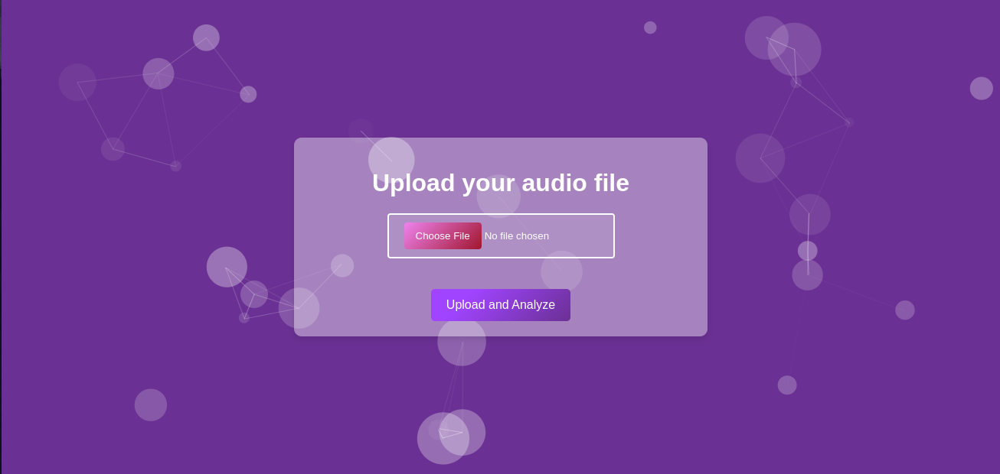
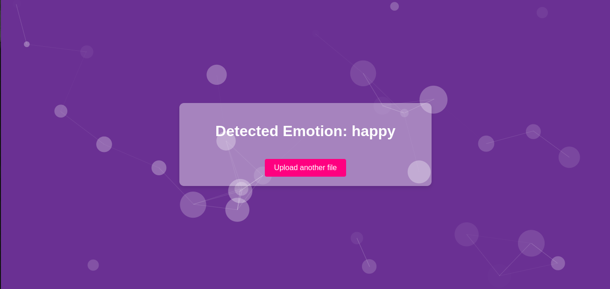

# Project Title: Speech Emotion Recognition
# Description
Speech Emotion Recognition (SER) is a Flask-based web application designed to analyze audio files and predict the emotional state of the speaker. Utilizing advanced machine learning techniques and audio processing libraries, SER offers a user-friendly interface for uploading voice recordings and instantly retrieves the emotional context expressed in the speech. This project aims to bridge the gap between human emotions and machine understanding, providing valuable insights for emotional analytics, customer service enhancement, therapy, and personal use.
# Technical Implementation
- This project utilizes Python and the Librosa library for analyzing audio signals through feature extraction methodologies such as Mel Frequency Cepstral Coefficients (MFCC), chroma-stft, and mel-spectrogram. The analysis involves training a machine learning model to classify different emotional states from audio files. This system uses the Ryerson Audio-Visual Database of Emotional Speech and Song (RAVDESS) dataset for training and validation.
- MLPClassifier: The model uses a deep neural network, including multiple layers of perceptrons, making it capable of capturing complex patterns in audio data. This approach is particularly effective in handling the subtle nuances that distinguish different emotional states in spoken language. The MLP is configured with one hidden layer of 300 neurons, utilizing 'ReLU' activation function and 'adam' optimizer—an adaptive learning rate method proved efficient for datasets of this nature.
# Features
- Audio File Upload: Users can easily upload audio files through a clean and simple web interface.
- Real-time Emotion Analysis: The application processes audio files to detect and display the emotion of the speaker.
- Visual Feedback: Utilizes Particles.js to create a dynamic background, enhancing the user interaction experience.
- Responsive Design: The interface adjusts seamlessly across different devices, ensuring accessibility and ease of use.
# Technologies Used
- Python: Primary programming language.
- Flask: Serves as the backbone of the application, handling routing, requests, and server-side logic.
- Librosa: Used for audio signal processing, feature extraction, and analysis.
- Scikit-Learn: Employs machine learning models for emotion prediction.
- Particles.js: Enhances the frontend with interactive particle system effects.
- HTML/CSS/JavaScript: Structures and styles the web interface.

## Application Screenshots

### Main Upload Page
Here's where users can upload their audio files for emotion analysis:

### Results Page
This screenshot shows the application after it has analyzed an audio file and returned the emotion results:

